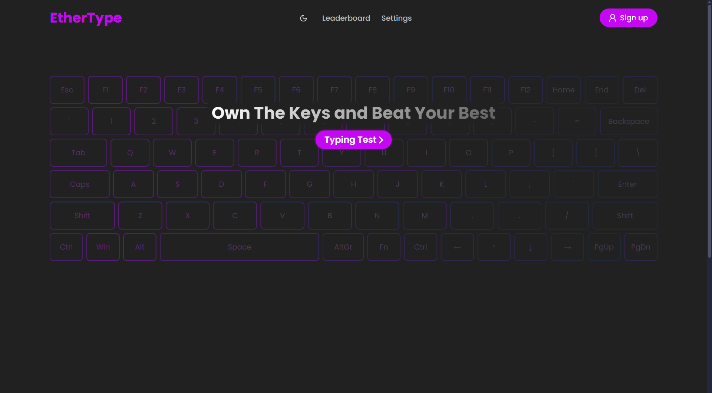

# EtherType - Typing Speed Test System

EtherType is a full-stack typing speed test application built with **React, TypeScript, Express.js, and PostgreSQL**.

It allows users to take customizable typing tests, view detailed performance results, track their typing history, monitor activity through a calendar, and compare their performance with other users through a global leaderboard.

---

## Features

### Typing Test

* **Real-time typing test** with character-level feedback
* **Multiple test durations** — 15, 30, 60, and 120 seconds
* **Difficulty levels** — Easy, Medium, and Hard
* **Multiple cursor styles** — Default, Underline, and Block
* **Quick restart controls**
* Real-time tracking of typing progress and test state

### Performance & Analytics

* WPM (Words Per Minute) calculation
* Typing accuracy tracking
* Per-test performance graphs
* WPM visualization
* Accuracy visualization
* Average WPM analysis
* Average accuracy analysis
* Interactive scatter plots
* Typing activity calendar
* Detailed typing history

### User Features

* User registration and login
* JWT-based authentication
* HTTP-only cookie-based authentication
* Editable user profiles
* Personal typing history
* Global leaderboard
* User-specific performance statistics
* Persistent typing preferences

### User Interface

* Dark and light themes
* Responsive layout
* Custom cursor styles
* Responsive settings controls
* Loading states
* Interactive charts and tooltips

---

## Project Architecture

EtherType follows a client-server architecture with a React frontend communicating with an Express.js backend through REST APIs.

```text
Project-7-TypingSystem/
│
├── client/                         # React + TypeScript frontend
│   ├── public/
│   ├── src/
│   │   ├── api/                    # API request functions
│   │   ├── assets/                 # Images and static assets
│   │   ├── components/             # Reusable UI components
│   │   ├── context/                # React Context
│   │   ├── hooks/                  # Custom React hooks
│   │   ├── pages/                  # Application pages
│   │   ├── schemas/                # Zod validation schemas
│   │   ├── store/                  # Zustand stores
│   │   ├── styles/                 # CSS files
│   │   ├── types/                  # TypeScript types
│   │   ├── App.tsx
│   │   ├── App.css
│   │   ├── index.css
│   │   └── main.tsx
│   ├── .env.example
│   ├── eslint.config.js
│   ├── package.json
│   ├── tsconfig.json
│   ├── vercel.json
│   └── vite.config.ts
│
├── server/                         # Express + TypeScript backend
│   ├── src/
│   │   ├── config/
│   │   │   └── db.ts               # PostgreSQL connection
│   │   ├── controllers/             # Request handling logic
│   │   ├── middlewares/
│   │   │   └── auth.ts              # Authentication middleware
│   │   ├── routes/                  # API route definitions
│   │   ├── types/                   # Backend TypeScript types
│   │   └── index.ts                 # Server entry point
│   ├── .env.example
│   ├── package.json
│   └── tsconfig.json
│
├── .hintrc
└── README.md
```

### Frontend Structure

The frontend is organized into separate layers for API communication, UI components, pages, hooks, state management, validation, and TypeScript types.

* **`api/`** — Functions responsible for communicating with backend APIs
* **`components/`** — Reusable UI components and charts
* **`context/`** — Theme-related React Context
* **`hooks/`** — Custom hooks for API operations and application logic
* **`pages/`** — Main application pages
* **`schemas/`** — Zod schemas used for frontend validation
* **`store/`** — Zustand stores for client-side application state
* **`types/`** — TypeScript interfaces and types
* **`styles/`** — Component-specific and global CSS

### Backend Structure

The backend follows an Express.js route-controller architecture.

* **`routes/`** — Defines API endpoints
* **`controllers/`** — Handles request processing and business logic
* **`middlewares/`** — Authentication middleware
* **`config/`** — PostgreSQL database configuration
* **`types/`** — TypeScript types used by the backend

---

## Tech Stack

### Frontend

| Technology          | Purpose                           |
| ------------------- | --------------------------------- |
| **React 19**        | Building the user interface       |
| **TypeScript**      | Static typing                     |
| **Vite**            | Development server and build tool |
| **Tailwind CSS**    | Utility-first styling             |
| **React Router**    | Client-side routing               |
| **Zustand**         | Client-side state management      |
| **TanStack Query**  | Server-state management           |
| **Recharts**        | Data visualization                |
| **React Hook Form** | Form handling                     |
| **Zod**             | Frontend validation               |
| **Axios**           | HTTP requests                     |
| **Lucide React**    | Icons                             |

### Backend

| Technology        | Purpose                      |
| ----------------- | ---------------------------- |
| **Express.js 5**  | REST API server              |
| **TypeScript**    | Static typing                |
| **PostgreSQL**    | Relational database          |
| **pg**            | PostgreSQL driver            |
| **JWT**           | Authentication               |
| **bcryptjs**      | Password hashing             |
| **Cookie Parser** | Cookie handling              |
| **CORS**          | Cross-origin request control |

---

## API

The backend exposes REST API routes under the `/api` prefix.

### Authentication

```text
/api/auth
```

Handles user authentication and current-user operations.

### Typing Tests

```text
/api/tests
```

Handles typing test prompt-related operations.

### Tokens

```text
/api/tokens
```

Handles typing token-related operations.

### Leaderboard

```text
/api/leaderboard
```

Handles leaderboard data and user leaderboard information.

### Profile

```text
/api/editProfile
```

Handles user profile updates.

### User Test History

```text
/api/userTestsData
```

Retrieves typing test data associated with a user.

### Test Lifecycle

```text
/api/testStarted
/api/testCompleted
```

Handles test initialization and test completion.

### Typing Statistics

```text
/api/timeTyping
/api/totalCharsTyped
```

Handles typing-time and character-count related data.

### Registered API Routes

```text
/api/auth
/api/tests
/api/tokens
/api/leaderboard
/api/editProfile
/api/userTestsData
/api/testStarted
/api/testCompleted
/api/timeTyping
/api/totalCharsTyped
```

---

## Database

EtherType uses **PostgreSQL** as its relational database.

The current database contains three main tables:

```text
┌──────────────────┐
│     users        │
├──────────────────┤
│ typing_tokens    │
├──────────────────┤
│ tests_time       │
└──────────────────┘
```

### Tables

* **`users`** — Stores user-related information
* **`typing_tokens`** — Stores typing token-related data
* **`tests_time`** — Stores typing test and timing-related data

> The repository currently does not include a `schema.sql` file or database migration system. PostgreSQL must therefore be configured separately and the required database tables must be available before running the application.

---

## Authentication & Security

Authentication is implemented using JWT-based authentication.

### Authentication flow

1. User signs up or logs in.
2. The backend validates the credentials.
3. Passwords are hashed using `bcryptjs`.
4. A JWT is generated after successful authentication.
5. The authentication token is handled using an HTTP-only cookie.
6. Protected backend routes use authentication middleware to verify the user.

### CORS

The backend CORS configuration allows requests from the application's known frontend origins:

* Local development frontend
* Production frontend

Requests from other origins are not allowed by the configured CORS policy.

### Input Validation

**Zod is currently used on the frontend** for validating supported form data.

---

## State Management

### Zustand

Zustand is used for client-side application state.

The project currently contains the following stores:

```text
useDifficultyTokenStore
useSettingsStore
useTestRestartStore
useTestStartedStore
useTestTimeLeftStore
useTestTimeStore
useTestTotalCharsTypedStore
useTypingAreaFocusedStore
```

These stores handle areas such as:

* Test settings
* Test state
* Timer state
* Remaining test time
* Difficulty-related token state
* Character tracking
* Test restart state
* Typing-area focus state

### TanStack Query

TanStack Query is used for server-state operations such as fetching and managing API data.

---

## Result Visualization

The application uses **Recharts** to visualize typing performance.

### Charts

#### WPM Bar Chart

`WpmBarChart.tsx`

Displays WPM-related typing performance.

#### Accuracy Bar Chart

`AccuracyBarChart.tsx`

Displays accuracy-related results.

#### Average WPM Scatter Chart

`AverageWpmScatterChart.tsx`

Visualizes average WPM performance across tests.

#### Average Accuracy Scatter Chart

`AverageAccuracyScatterChart.tsx`

Visualizes average accuracy across tests.

#### Custom Tooltips

The project includes custom tooltip components for displaying additional information when interacting with charts.

---

## Key Frontend Components

### `TypingArea.tsx`

The main typing interface.

It handles the typing interaction and provides character-level feedback while the user completes a test.

### `SettingsBar.tsx`

Provides controls for configuring:

* Test duration
* Difficulty
* Cursor style

### Cursor Components

The project provides three cursor implementations:

```text
CursorDefault.tsx
CursorUnderline.tsx
CursorBlock.tsx
```

### `TypingTestNavbar.tsx`

Provides navigation and controls specific to the typing test interface.

### `ResultGraph.tsx`

Used for displaying typing-test result information after a test is completed.

### `LeaberboardTable.tsx`

Displays leaderboard information.

> The component is currently named `LeaberboardTable.tsx` in the project.

---

## Application Pages

The frontend currently contains the following pages:

```text
Home.tsx
TypingTest.tsx
Results.tsx
Leaderboard.tsx
Profile.tsx
Edit.tsx
Login.tsx
Signup.tsx
Settings.tsx
Features.tsx
```

### Main User Flow

```text
Home
  ↓
Login / Signup
  ↓
Typing Test
  ↓
Results
  ↓
Profile / Statistics
  ↓
Leaderboard
```

---

## Typing Test Settings

Users can configure the typing test through the settings interface.

### Test Duration

Available durations:

* 15 seconds
* 30 seconds
* 60 seconds
* 120 seconds

### Difficulty

Available difficulty levels:

* Easy
* Medium
* Hard

### Cursor Style

Available cursor styles:

* Default
* Underline
* Block

### Quick Controls

The application also supports keyboard controls for starting/restarting the typing test.

---

## How to Use

### 1. Create an Account

Open the application and create an account using the signup page.

### 2. Log In

Log in using your registered credentials.

### 3. Configure the Test

Choose:

* Test duration
* Difficulty
* Cursor style

### 4. Start Typing

Start the typing test and type the displayed text as accurately and quickly as possible.

### 5. View Results

After completing the test, view your:

* WPM
* Accuracy
* Typing performance
* Graphs and statistics

### 6. Track Progress

Visit your profile to view your previous typing activity and performance.

### 7. Compare Performance

Use the leaderboard to compare your performance with other users.

---

## Theme System

The application supports both light and dark themes.

Theme state is managed using React Context:

```text
ThemeContext.tsx
ThemeContextObject.ts
useTheme.ts
```

The project also includes custom styling for areas such as:

* Typing interface
* Cursor styles
* Loading states
* Profile activity calendar
* Typing test controls

---

## Getting Started

### Prerequisites

Make sure the following are installed:

* **Node.js** 18 or higher
* **npm**
* **PostgreSQL**
* **Git**

---

## Installation

### 1. Clone the Repository

```bash
git clone https://github.com/ankush-github-11/typing-test-system.git
cd typing-test-system
```

---

### 2. Configure the Backend

Navigate to the server:

```bash
cd server
```

Install dependencies:

```bash
npm install
```

Create your environment file:

```bash
cp .env.example .env
```

Configure the required environment variables according to the provided `.env.example`.

For local development, the backend runs on:

```text
http://localhost:5000
```

---

### 3. Configure PostgreSQL

Create/configure a PostgreSQL database and make sure the required project tables are available.

The backend uses the `DATABASE_URL` environment variable to connect to PostgreSQL.

The repository does not currently contain database migrations or a `schema.sql` file, so database initialization must be handled separately.

---

### 4. Start the Backend

From the `server` directory:

```bash
npm run dev
```

The backend will run on:

```text
http://localhost:5000
```

---

### 5. Configure the Frontend

Open another terminal and navigate to the client:

```bash
cd client
```

Install dependencies:

```bash
npm install
```

Create the frontend environment file:

```bash
cp .env.example .env
```

Configure the API URL in the environment file:

```env
VITE_API_URL=http://localhost:5000
```

---

### 6. Start the Frontend

```bash
npm run dev
```

The Vite development server runs on:

```text
http://localhost:5173
```

---

## Production Build

### Frontend

```bash
cd client
npm run build
```

To preview the production build locally:

```bash
npm run preview
```

### Backend

```bash
cd server
npm run build
```

The production server can then be started using the project's configured start script:

```bash
npm start
```

---

## Deployment

### Frontend

The frontend is deployed using **Vercel**.

Production frontend:


[https://typing-test-system.vercel.app](https://typing-test-system.vercel.app)


### Backend

The backend is deployed using **Render**.

Production backend:

[https://typing-test-system.onrender.com](https://typing-test-system.onrender.com)

The frontend communicates with the deployed backend through the configured `VITE_API_URL`.

---

## Project Statistics

Based on the current project structure:

| Area                  | Count |
| --------------------- | ----: |
| Frontend components   |    25 |
| Custom React hooks    |    18 |
| Zustand stores        |     8 |
| Frontend API modules  |    13 |
| Application pages     |    10 |
| Backend controllers   |     9 |
| Backend route modules |    10 |
| PostgreSQL tables     |     3 |

These numbers reflect the current repository structure and may change as the project evolves.

---

## Development Structure

The project separates responsibilities between the frontend and backend.

```text
React UI
   │
   ├── Components
   ├── Pages
   ├── Hooks
   ├── Zustand Stores
   └── API Layer
          │
          ▼
      REST API
          │
          ▼
   Express.js Backend
          │
   ┌──────┴──────┐
   │             │
Routes      Middleware
   │             │
   └──────┬──────┘
          ▼
     Controllers
          │
          ▼
      PostgreSQL
```

This separation keeps UI logic, API communication, backend request handling, authentication, and database access organized independently.

---

## Contributing 🤝

Contributions are welcome.

### Development Workflow

1. Fork the repository.
2. Create a feature branch.

```bash
git checkout -b feature/your-feature
```

3. Make your changes.
4. Commit your changes.

```bash
git commit -m "Add your feature"
```

5. Push the branch.

```bash
git push origin feature/your-feature
```

6. Open a Pull Request.

When contributing, try to:

* Follow the existing TypeScript structure
* Keep components and hooks focused on their responsibilities
* Use meaningful commit messages
* Keep API and frontend types consistent
* Update the README when adding significant functionality

---

## Troubleshooting

### Database Connection Error

Check that:

* PostgreSQL is running
* `DATABASE_URL` is correct
* The required database exists
* The required tables are available

### CORS Error

Check that the frontend is running from one of the origins allowed by the backend CORS configuration.

For local development, verify that the frontend is using the expected localhost URL.

### Typing Test Does Not Start

Check that:

* The backend is running
* The frontend can reach the backend API
* Typing test data is being returned successfully
* The configured `VITE_API_URL` is correct

### Authentication Issues

Check that:

* The backend is running
* The JWT secret is configured
* Cookies are being handled correctly
* The frontend and backend origins match the configured CORS settings

---

## Project Highlights

EtherType demonstrates the use of several modern full-stack development concepts:

* React component architecture
* TypeScript across frontend and backend
* REST API development with Express.js
* PostgreSQL database integration
* JWT authentication
* Password hashing with bcryptjs
* HTTP-only cookies
* Zustand state management
* TanStack Query
* Form handling with React Hook Form
* Frontend validation with Zod
* Data visualization with Recharts
* Responsive UI development
* Vercel frontend deployment
* Render backend deployment

---

## License

This project is licensed under the **ISC License**.

See the `LICENSE` file for more information.

---

## Author

**Ankush**

GitHub: [ankush-github-11](https://github.com/ankush-github-11)

---

## Acknowledgments

* Inspired by popular typing platforms such as TypeRacer and Monkeytype
* Built using the React, TypeScript, Express.js, and PostgreSQL ecosystem
* Uses open-source libraries including Recharts, Zustand, TanStack Query, Zod, React Hook Form, Axios, and Lucide React

---

## ⌨️ EtherType

A full-stack typing application focused on helping users practice typing, measure their performance, and track their progress over time.

**Made with ⌨️ and ❤️**

**Happy Typing! 🚀**
